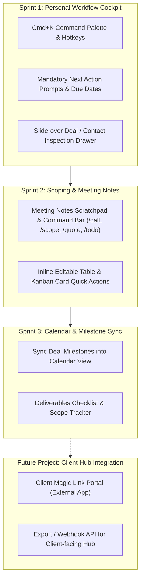

# Freelance CRM — Personal Operator Cockpit

> **Strategic Scope:** This application is strictly an **internal personal cockpit for the solo freelancer / creative operator**. It is **not** a client-facing portal. Client-facing portals, magic links, and public client hubs belong to a downstream project that will integrate with and consume data from this CRM.

---

## 1. The Solo Freelancer Problem: Why Generic CRMs Fail

Generic CRMs (HubSpot, Salesforce, Pipedrive) are engineered for sales departments managing high-volume outbound cadences and sales rep quotas.

For a solo freelancer, the daily bottlenecks are:
1. **Administrative Friction:** If logging a call note or moving a deal takes 5 clicks and a page reload, you stop using it after a week.
2. **Deals Falling Through Cracks:** Leads stall simply because there is no clear, scheduled next step on the calendar.
3. **Scattered Context:** Project notes, deal values (`Kč`), contact info, meeting dates, and deliverables end up fragmented across Apple Notes, Google Calendar, and WhatsApp.

---

## 2. Competitive Landscape Breakdown (What to Steal vs. What to Skip)

| Tool | Category | What to Steal for Your Personal CRM | What to Skip (Why it doesn't fit) |
| :--- | :--- | :--- | :--- |
| **Linear** | Issue Tracking / Dev Cockpit | **Keyboard-first speed**, `Cmd+K` palette, instant drawer modals, optimistic UI, zero-lag feel. | Software bug tracking workflows; no client/currency awareness. |
| **Pipedrive** | Mid-market Sales CRM | **"Mandatory Next Action"** rule (every deal must have a clear next task and due date). | Bloated B2B enterprise fields; outbound sales quota noise. |
| **Attio** | Modern Data-Dense CRM | **Fluid table & Kanban views**, inline editing without opening modals, clean monospace typography for numbers. | Geared towards venture-backed SaaS sales teams and company hierarchies. |
| **Notion** | Modular Notes & DB | Relational data simplicity (Clicking a company shows its contacts, active deals, and call notes together). | Clunky mobile performance, no built-in reminders, no native calendar time-blocking. |
| **Twenty** *(Open-Source)* | Modern OS CRM | Clean Tailwind/Lucide interface, developer-friendly clean schema, open data control. | Targets corporate SDRs; no awareness of freelancer milestone scoping. |
| **Close / Superhuman** | High-velocity Email/Sales | **Hotkeys (`H`/`J`/`K`/`L`, `N` for new, `E` for edit)**. | Cold outbound calling cadences; phone dialers. |

---

## 3. Core Features for Your Personal Cockpit

### 🎯 1. Linear-Grade Command Palette (`Cmd+K`) & Hotkeys
* **Universal search & action menu:**
  * `Cmd+K` / `Ctrl+K`: Opens palette to find any contact, company, deal, or date instantly.
  * `N`: Quick-add deal drawer.
  * `C`: Quick-add contact.
  * `L`: Quick-log call / meeting note.
  * `Tab` / Arrow keys (`H`, `J`, `K`, `L`): Navigate deals in the Kanban board without a mouse.
* **Why it matters:** You can log interactions and update statuses in 3 seconds while on a client phone call.

---

### ⚡ 2. The "Mandatory Next Action" Principle (GTD Style)
* Borrowed from David Allen's Getting Things Done & Pipedrive:
* **Rule:** A deal can never sit in an active stage without an explicit **Next Action** and a **Due Date** (e.g., `"Send revised scope — Tomorrow 14:30"`).
* If a deal has no next step, it shows an amber `⚠️ No next step set` prompt.

---

### 📝 3. Fast Meeting & Scope Scratchpad (Internal Notes & Command Bar)
* Accessible directly from:
  * **Deal / Company Side Drawer:** Click any deal or contact to open the scratchpad markdown editor.
  * **Command Palette (`Cmd+K` / Command Bar):** Quick-trigger note scratchpad actions and templates directly from the global search bar without leaving the keyboard.
* Quick slash-commands & palette actions:
  * `/call`: Inserts call log header with today's date & time.
  * `/scope`: Inserts bulleted deliverables list.
  * `/quote`: Inserts budget calculations (e.g., `Base build: 25 000 Kč + CMS: 7 000 Kč = 32 000 Kč`).
  * `/todo`: Inserts action items that sync to your dashboard's follow-up list.

---

### 🗓️ 4. Unified Personal Calendar (Calendar + Milestones)
* Connects directly with the existing `components/calendar/calendar-view.tsx`:
  * **Calls & Meetings:** Discovery calls, check-in syncs.
  * **Project Milestones:** Scope deadline, first draft presentation, final handoff.
  * **Follow-up Triggers:** Reminder to follow up on outstanding quotes.

---

### 🔌 5. Future-Proof Integration Hooks (The "Next Step" Bridge)
* While this tool is internal-only, its data architecture is designed with clear hooks for the upcoming client portal:
  * `deals`: Holds title, company_id, value, stage, probability, startDate, endDate.
  * `deliverables`: List of scope items, statuses (`Pending`, `In Progress`, `Done`), and client sign-off flags.
  * `invoices`: Internal log of deposit (e.g. 50%) and final balance, paid status, and invoice date.
  * **Export/Webhook Ready:** Future client hub can read directly from this schema or trigger updates when a client signs off or pays.

---

## 4. Design Choices & Visual Language

### High-Signal, Distraction-Free Aesthetic
* **Theme:** Clean, modern workspace with light/dark neutral tones (Slate/Zinc).
* **Typography:** Clean sans-serif (Inter / Geist) with `font-mono` / `tabular-nums` for financial values (`15 000 Kč`, `32 000 Kč`) so columns align with mathematical precision.
* **Semantic Palette (Consistent with `components/calendar`):**
  * 🔵 **Blue (`#266df0` / `#e9f0ff`):** General deals, follow-ups, tech/development projects.
  * 🟣 **Violet (`#805ad5` / `#f0eaff`):** Architecture, creative direction, design projects.
  * 🟠 **Amber (`#c4882b` / `#fff3df`):** Prospects, pending next actions, follow-up alerts.
  * 🟢 **Green (`#43a878` / `#e7f6ee`):** Won deals, active projects, completed deliverables.

### Layout Architecture:
* **Left Sidebar:** Minimalist navigation (`Dashboard`, `Pipeline`, `Companies`, `Contacts`, `Calendar`, `Settings`).
* **Header Bar:** Global Search / `Cmd+K` trigger, Notifications, `+ New Deal` button.
* **Main Stage:**
  * **Overview Tab:** Follow-up task queue ("Do Today", "Do Tomorrow"), Pipeline summary metrics, Recent activity feed.
  * **Pipeline Tab:** Drag-and-drop Kanban + Dense table switch, filtered by stage and value.
  * **Calendar Tab:** Week/Day scheduling cockpit with deal milestones.
* **Right Slide-Over Sheet (Detail Drawer):** Opens without leaving the current view to review deal notes, edit fields inline, and check contact touch history.

---

## 5. Prioritized Implementation Roadmap

---

## 6. Comparison: Traditional CRMs vs. Your Personal Operator Cockpit

| Feature | Traditional CRM (HubSpot/Pipedrive) | Notion DIY Database | **Your Personal Freelance Cockpit** |
| :--- | :--- | :--- | :--- |
| **Focus** | Multi-seat sales teams, sales quotas | Generic flexible workspace | **Solo Freelancer / Creative Operator** |
| **Speed** | Slow, heavy, multi-click | Moderate, slow on mobile | **Instant keyboard navigation (`Cmd+K`)** |
| **Next Action Rule** | ⚠️ Only in Pipedrive, buried in menus | ❌ Requires manual property setup | ⚡ **Strict GTD enforcement on all active deals** |
| **Internal Scoping** | ❌ Complex quotes module | ⚠️ Unstructured text | 📝 **Clean structured markdown scratchpad** |
| **Calendar View** | ⚠️ Detached Google Cal sync | ⚠️ Basic DB calendar | 🗓️ **Integrated milestone & schedule grid** |
| **Downstream Export** | ⚠️ Locked into vendor ecosystem | ⚠️ Unstructured API | 🔌 **Clean schema ready for your future client hub** |
